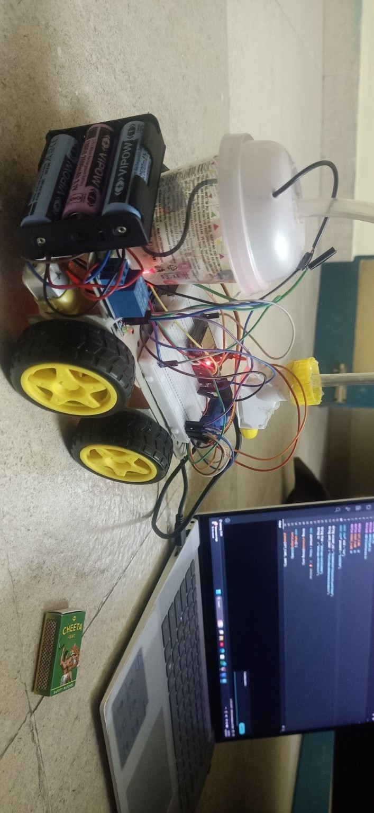
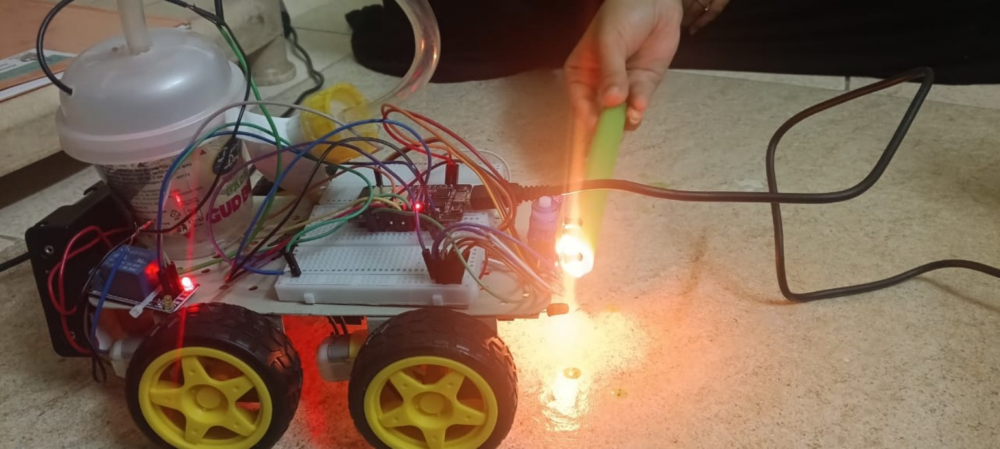
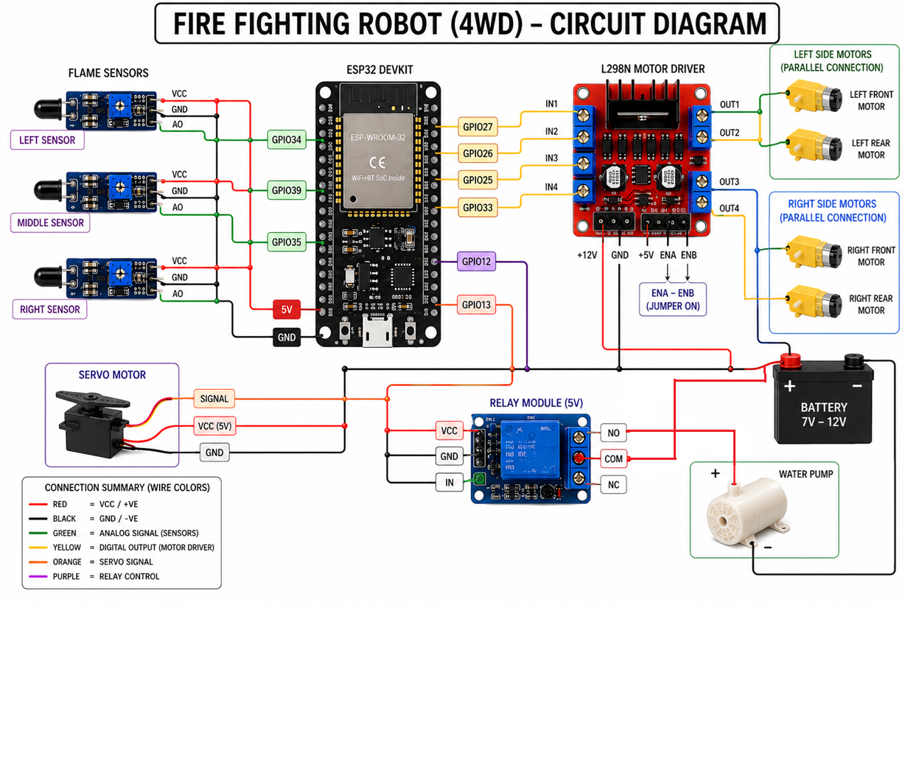
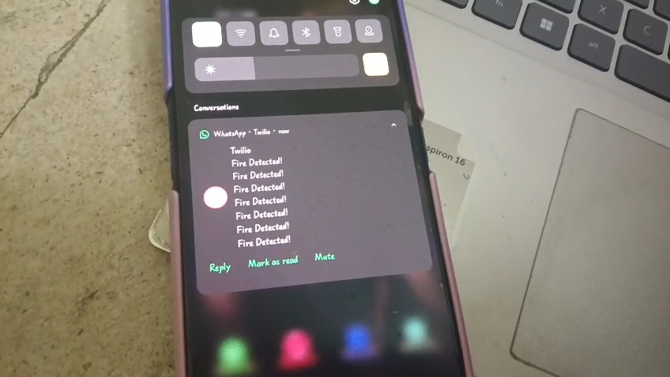

# Fire Fighting Robot
# 🔥 AI-Based Fire Fighting Robot using ESP32

> An IoT-enabled autonomous firefighting robot capable of detecting fire, navigating toward the source, extinguishing it using a water pump, and sending real-time WhatsApp alerts through the ESP32 microcontroller.

---

## 📖 Overview

Fire accidents pose a serious threat to human life and property, especially in hazardous environments where manual intervention can be dangerous. This project presents an intelligent firefighting robot that automatically detects fire, moves toward the flame, activates a water pump to suppress the fire, and sends real-time WhatsApp notifications using IoT.

The project combines embedded systems, robotics, and IoT technologies to provide a low-cost, automated fire safety solution.

---

# ✨ Key Features

- 🔥 Automatic fire detection using three flame sensors
- 🤖 Autonomous navigation towards the fire source
- 💧 Automatic water pump activation using relay module
- 🚿 Servo-controlled water spraying mechanism
- 📱 Real-time WhatsApp alert notifications
- 🌐 Wi-Fi connectivity using ESP32
- ⚡ Low-cost and portable design
- 🛡️ Reduces human intervention in hazardous situations

---

# 🛠 Hardware Components

| Component | Quantity |
|-----------|----------|
| ESP32 DevKit V1 | 1 |
| Flame Sensor Module | 3 |
| L298N Motor Driver | 1 |
| DC Gear Motors | 4 |
| Servo Motor (SG90) | 1 |
| Mini Water Pump | 1 |
| Relay Module | 1 |
| 18650 Li-ion Batteries | 3 |
| Breadboard | 1 |
| Jumper Wires | Multiple |
| Water Tank | 1 |

---

# 💻 Software & Technologies

- Arduino IDE
- Embedded C++
- ESP32 Board Package
- WiFi Library
- HTTPClient Library
- Twilio WhatsApp API

---

# 📷 Project Gallery

## Robot Prototype



---

## Fire Detection Testing



---

## Circuit Diagram



---

## WhatsApp Notification



---

# ⚙ Working Principle

1. The flame sensors continuously monitor the surroundings.

2. ESP32 reads the sensor values and determines the direction of the flame.

3. The robot automatically moves toward the detected fire.

4. Once it reaches the fire source, the relay activates the water pump.

5. The servo motor directs the water spray toward the flame.

6. Simultaneously, ESP32 sends a WhatsApp notification through the Twilio API.

7. The robot continues monitoring until no flame is detected.

---

# 📂 Repository Structure

```text
Fire-Fighting-Robot
│
├── code
│   ├── fire_fighting_robot.ino
│   └── README.md
│
├── docs
│   ├── Fire_Fighting_Robot_Project_Report.pdf
│   ├── Fire_Fighting_Robot_Presentation.pptx
│   └── README.md
│
├── images
│   ├── robot_hardware.jpg
│   ├── robot_testing.jpg
│   ├── circuit_diagram.png
│   ├── whatsapp_alert.jpeg
│   └── README.md
│
├── LICENSE
└── README.md
```

---

# 🚀 Future Enhancements

- ESP32-CAM integration for live video streaming
- AI-based fire recognition
- Smoke and gas sensor integration
- Mobile application for remote monitoring
- GPS tracking
- Cloud-based data logging
- Autonomous obstacle avoidance
- Larger water storage system

---

# 👨‍💻 My Contributions

This project was developed as part of a mini project, where I made significant contributions including:

- Designed and assembled the complete hardware prototype
- Programmed the ESP32 using Embedded C++
- Integrated flame sensors, relay, servo motor, and water pump
- Implemented autonomous fire detection and navigation logic
- Developed the WhatsApp alert system using the Twilio API
- Performed hardware testing, debugging, and system validation
- Prepared the final project prototype and demonstrations

---

# 📄 Documentation

Detailed documentation is available in the **docs** folder.

- 📘 Project Report
- 📊 Presentation Slides

---

# 🎯 Applications

- Industrial Safety
- Warehouses
- Laboratories
- Smart Buildings
- Residential Fire Safety
- Educational Robotics Projects

---

# 🤝 Acknowledgements

This project was developed as part of the **Embedded Systems and IoT Design Mini Project** under the Department of Electronics and Communication Engineering.

Special thanks to our faculty members for their continuous guidance and support throughout the project.

---

## ⭐ If you found this project useful, consider giving it a Star!
